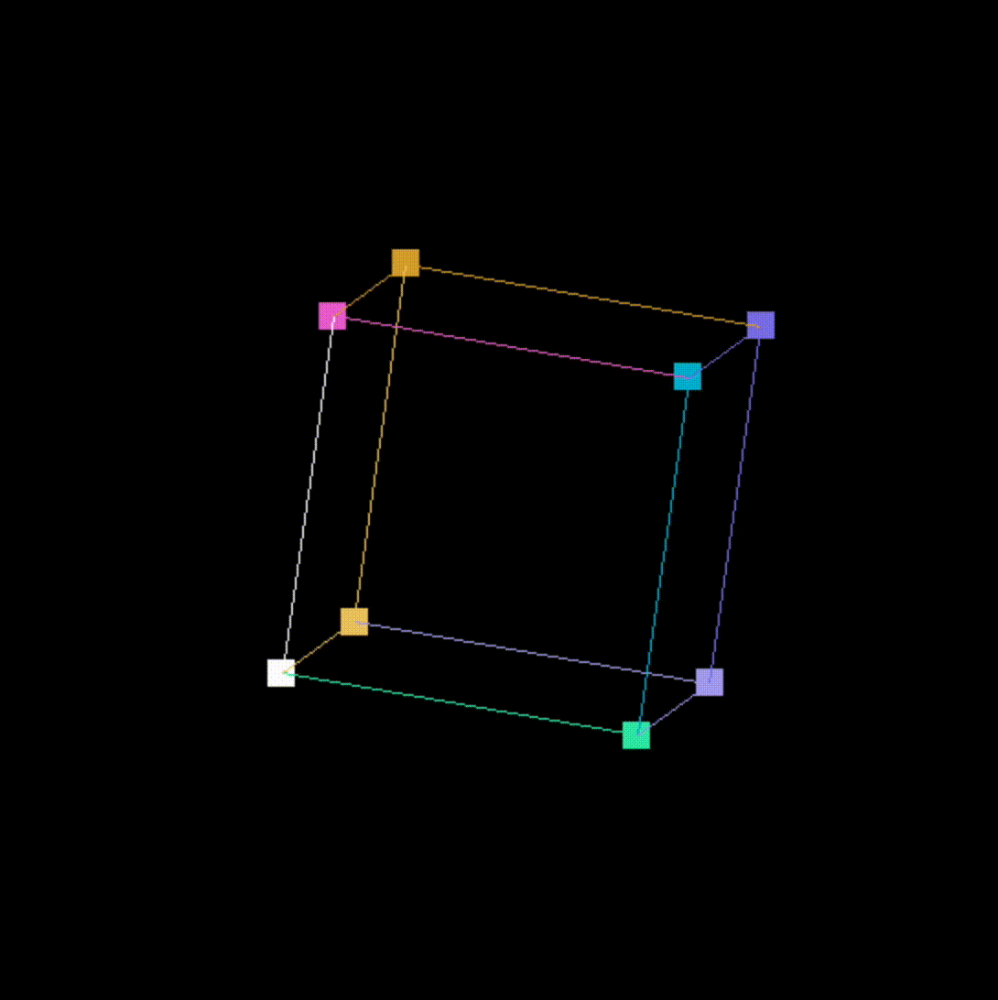

# Rotating 3D Cube in C using SDL2

This repository contains a minimal (and naive) C program drawing and animating a rotating 3D wireframe cube using [SDL2](https://www.libsdl.org/).

<p align="center">
  
</p>


## Installation

### Prerequisites

- You need **SDL2** development libraries.
- A C compiler (e.g., `clang` or `gcc`).

### Install SDL2

#### Linux (Debian/Ubuntu)

```sh
sudo apt-get update
sudo apt-get install libsdl2-dev
```

#### macOS

```sh
brew install sdl2
```

#### Windows

- Download development libraries from [SDL2 Downloads](https://www.libsdl.org/download-2.0.php).
- Follow platform/compiler-specific instructions in the SDL2 documentation.

---

## Building

Clone this repository (or save `main.c`, and the `Makefile`):

```sh
git clone <repo-url>
cd <repo-directory>
```

Build with `make`:

```sh
make
```

This produces an executable called `main.o`. Run it with:

```sh
./main.o
```


## Usage

- **Quit**: Press `q` or close the window.


## License

This project is released under the MIT license. Feel free to use, modify or distribute.
